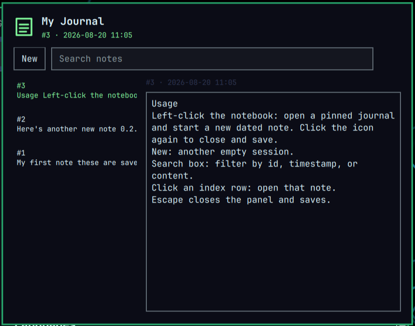

# My Journal for Omarchy

A stream-of-consciousness journal for the Omarchy Quattro bar. Click the notebook to start a new dated note. Search previous sessions by id, time, or text. Autosave writes JSON plus a readable `notes.txt`.



Plugin id: `io.github.mohuddle.myjournal`

## What it does

- Opening the panel creates a new empty note, stamps it with the current date and time, and puts the cursor on a blank line.
- **New** starts another session. The left index lists every saved note by id.
- Search filters the index. Click a row to reopen that note.
- Autosave (about a second after typing, and again on close) writes the full entry list to `journal.json` and `notes.txt`.
- The window stays pinned on top across workspaces until you click the notebook icon again.

No Omarchy keybindings are changed. Encryption is not included in this release.

## Data

```
~/.local/state/omarchy/myjournal/journal.json
~/.local/state/omarchy/myjournal/notes.txt
```

The JSON is an append-only list of sessions:

```json
[
  {
    "id": "1",
    "timestamp": "2026-08-19T10:10:00.000Z",
    "content": "Had a great brainstorming session about my new TUI app today."
  }
]
```

Blank sessions are dropped on close so the file does not fill with empty opens.

## Install

```bash
omarchy plugin add https://github.com/mohuddle/omarchy-myjournal.git --enable
```

Move the widget:

```bash
omarchy bar move io.github.mohuddle.myjournal --section right
```

## Usage

- Left-click the notebook: open a pinned journal and start a new dated note. Click the icon again to close and save.
- **New**: another empty session.
- Search box: filter by id, timestamp, or content.
- Click an index row: open that note.
- Escape closes the panel and saves.

## Remove

```bash
omarchy plugin remove io.github.mohuddle.myjournal
```

Journal files under `~/.local/state/omarchy/myjournal/` are left in place. To start over:

```bash
rm -rf ~/.local/state/omarchy/myjournal
```

## Development checks

```bash
omarchy plugin validate .
node tests/model.test.js
```

## License

MIT. See [LICENSE](LICENSE).
